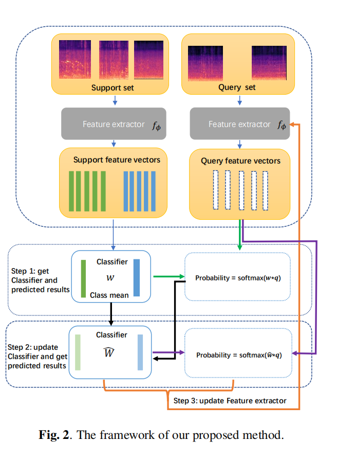

## DCASE2021 task5 code
This is our submision code in DCASE2021 task5.  
We use transductive inference for few shot learning, which maximizes the mutual information between the query features and their label predictions for a given few-shot task, in conjunction with a supervision loss based on the support set. Furthermore, we propose a mutual learning framework, which makes feature extractor and classifier to help each other. 

  

#### How to run it?
##### First step
Please follow the offical code of DCASE2021 task5, to extract the feature,and save it. Because our code are based the offical code, so you can directly use the feature extracted from offical baseline, or you can directly use our offered feature.  
When you get the mel-feature, please set the true path on config.yaml file  

##### Second step
bash runme.sh  
bash evaluate.sh  
after that you can get the results.

##### NOTE
As our paper describe, our methods have a lot of hyper-parameter, we do not spend a lot of time to find the best hyper-parameters . we also provide part of our training model. If you cannot get best results when you train your model, please try to tune the parameter *self.iter* in tim.py file. As our experiments, if you use our ML framework, this parameter may not offer too much effect to final results, but if you only use transductive learning methods, this parameters is very import.  

##### How to use ML framework?
In main.py file, you can find *iter_num = 0* paramter, when iter_num = 0, it indicate we do not update feature extractor, so it means do not use ML framework. iter_num > 0 indicate the times we update feature extractor.  

##### Future work
We must admit this work is our first try to few-shot event detection, there too many hyper-parameter and it has a lot of drawback. In the feature, we will try to find the robust methods. If you have interesting about this, welcome to contact me.

##### Reference
Our code are based following code.  
https://github.com/c4dm/dcase-few-shot-bioacoustic  
https://github.com/mboudiaf/TIM

